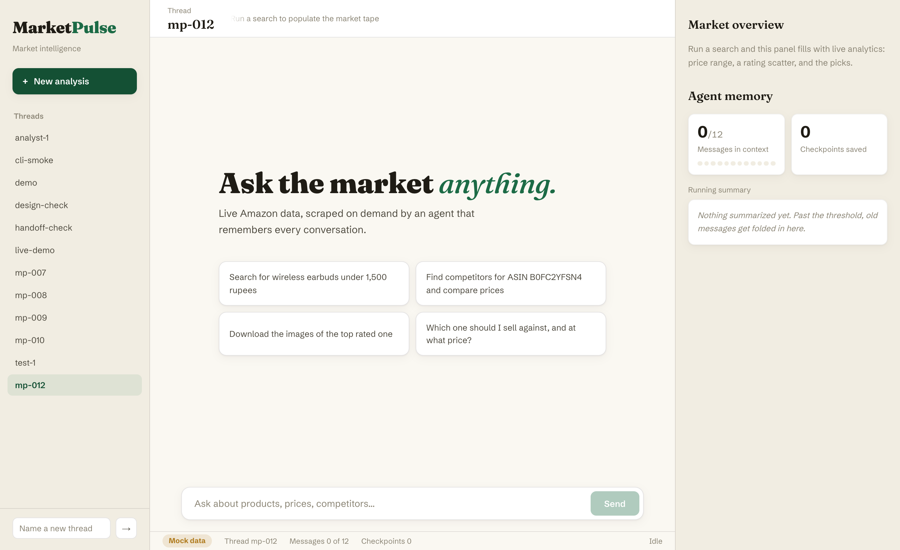
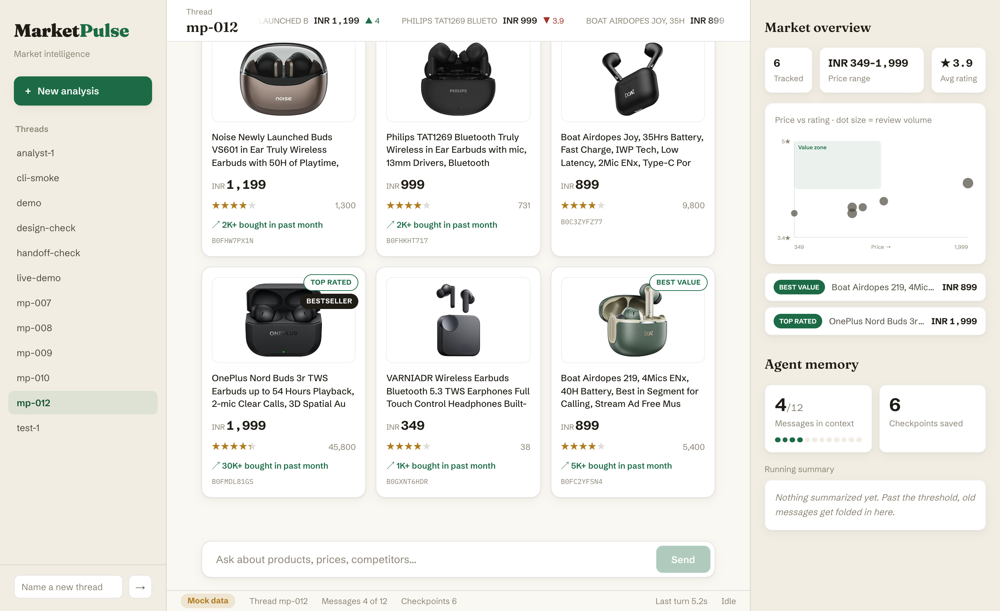
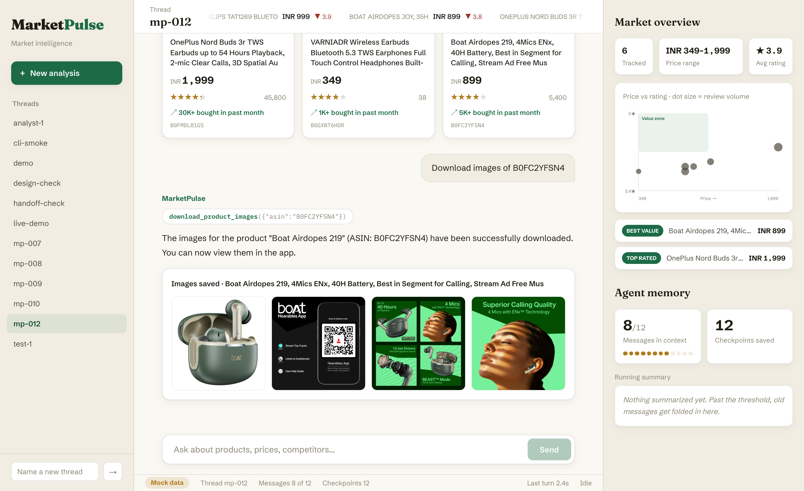
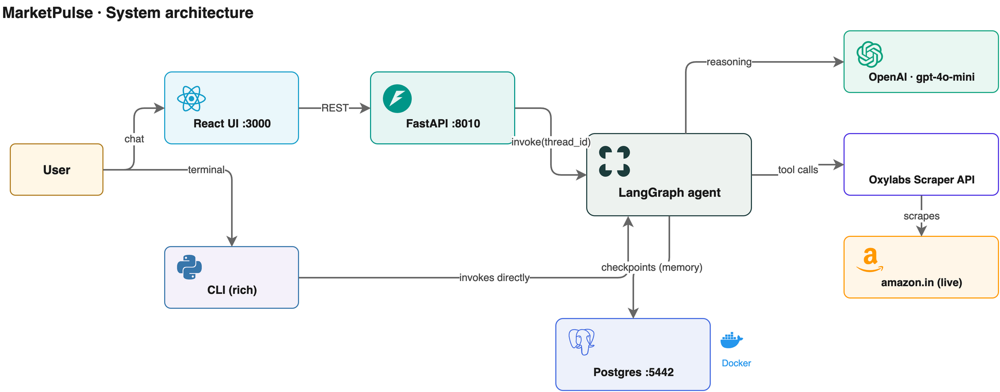
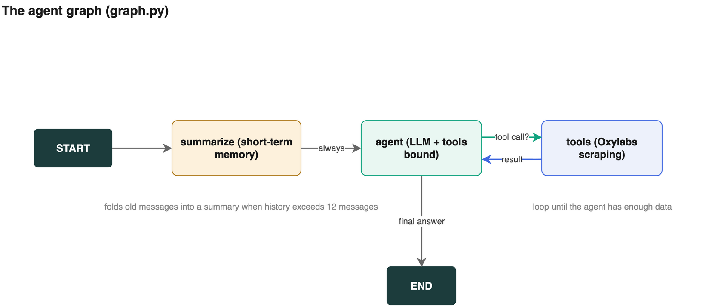
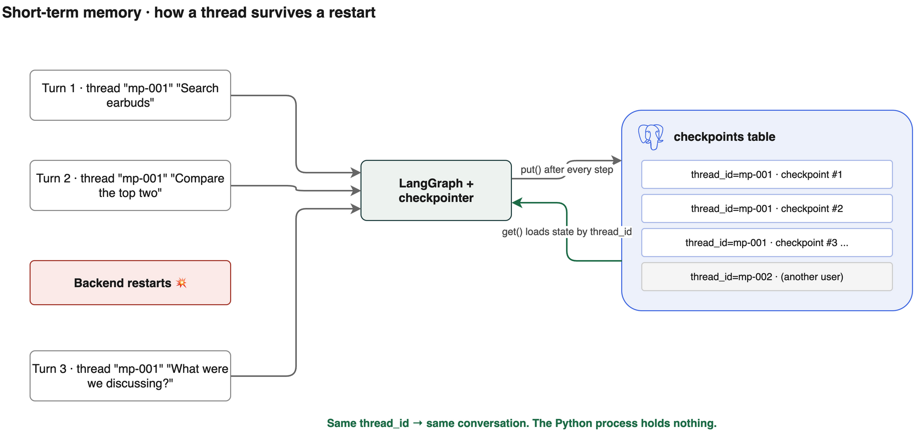
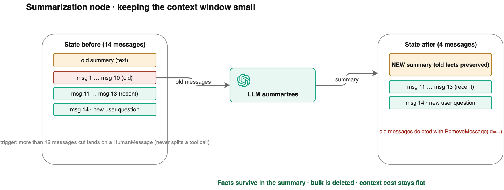
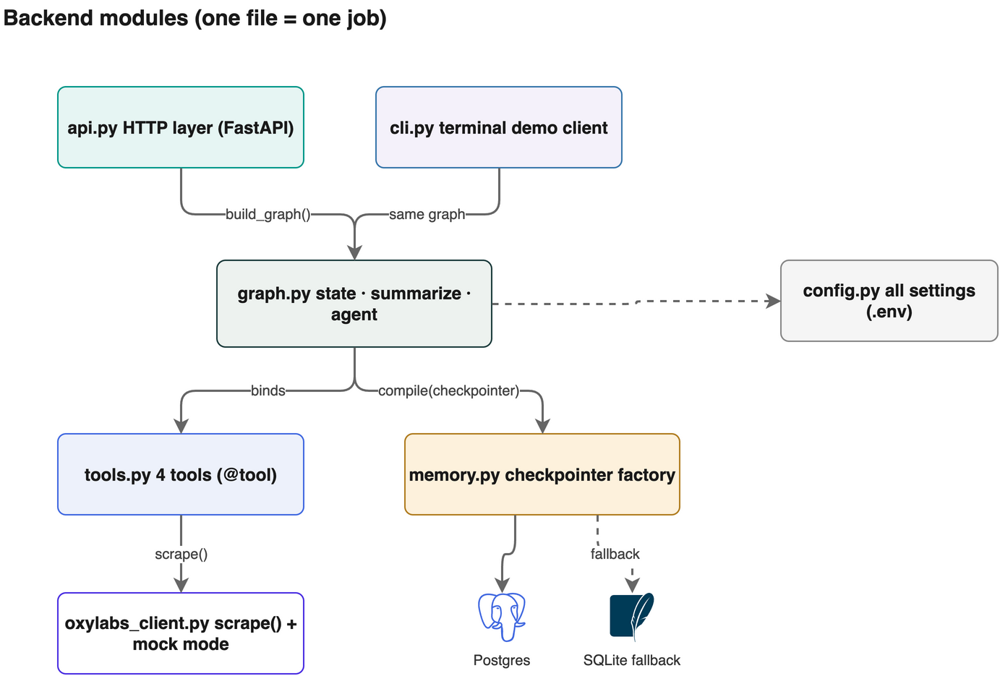

# MarketPulse

**An AI market intelligence agent with enterprise-grade short-term memory.**

Ask it a question in plain English — *"Search wireless earbuds under ₹1,500 and find
competitors for the top one"* — and a LangGraph agent scrapes Amazon live through the
Oxylabs Web Scraper API, compares prices, downloads product images, and answers on an
analytics dashboard. Every conversation is persisted in Postgres with **LangGraph
checkpointers**, and a **hand-built summarization node** keeps long conversations cheap.



| Ask a question, get cards + live analytics | The agent downloads product images |
|---|---|
|  |  |



## What this project teaches

| Concept | Where to look |
|---------|---------------|
| Checkpointers (InMemory → SQLite → Postgres) | `concepts/01_checkpointers.ipynb` |
| Building a summarization node from scratch | `concepts/02_summarization_node.ipynb` |
| The production agent graph | `backend/graph.py` |
| Tools and tool design | `backend/tools.py` |
| Checkpointer factory (swap DBs in one line) | `backend/memory.py` |
| HTTP layer around an agent | `backend/api.py` |
| Watching an agent think (streaming) | `backend/cli.py` |

## The agent graph

Every turn runs through the same loop: memory management first, then the agent
decides whether to scrape or answer.



## How memory works

The checkpointer saves the full graph state to Postgres after every step, keyed by
`thread_id`. Kill the server, restart it, ask "what were we discussing?" — the agent
remembers, because the Python process never held the memory in the first place.



When a thread grows past 12 messages, the summarization node folds old messages into
a running summary and deletes them with `RemoveMessage`. Facts survive, bulk does not.



## Backend layout

One file, one job. The graph never knows which database it is using — that is the
point of the checkpointer interface.



```
backend/
├── config.py           All settings, read from .env
├── oxylabs_client.py   One scrape() function + mock mode + cache
├── tools.py            The agent's 4 tools (@tool)
├── graph.py            State, summarize node, agent node, wiring  ★ start here
├── memory.py           Checkpointer factory (Postgres, SQLite fallback)
├── api.py              FastAPI: /chat, /threads, /downloads
├── cli.py              Terminal client that narrates every tool call
└── fixtures/           Real saved Amazon responses (power mock mode)
```

## Setup

Requirements: [uv](https://docs.astral.sh/uv/), [just](https://github.com/casey/just),
Docker, Node 18+. On macOS: `brew install uv just`.

```bash
# 1. Keys
cp .env.example .env        # add OPENAI_API_KEY (+ Oxylabs keys for live scraping)

# 2. Install everything
just setup

# 3. Run it (starts Postgres + backend + frontend together)
just run
```

Open **http://localhost:3000**. That's it.

No Oxylabs account? Everything still works: leave the Oxylabs keys empty and the app
serves real saved Amazon data from `backend/fixtures/` (the status bar shows "Mock data").

## All commands

Run `just` with no arguments to see this list.

| Command | What it does |
|---------|--------------|
| `just setup` | Install Python + frontend dependencies |
| `just run` | Postgres + backend + frontend, one command |
| `just backend` | Backend only (live scraping), port 8010 |
| `just backend-mock` | Backend with saved fixture data, zero credits used |
| `just frontend` | React dev server, port 3000 |
| `just cli` | Chat with the agent in the terminal |
| `just cli my-thread` | CLI on a named thread |
| `just cli-mock` | CLI with mock data |
| `just notebooks` | Open the concept notebooks in Jupyter |
| `just psql` | psql shell into the checkpoints database |
| `just viewer` | open the visual database viewer (pgweb) in the browser |
| `just diagrams` | Re-export the architecture diagrams to PNG |
| `just clean` | Stop Postgres, remove caches |

## The live demo script (for class)

One continuous conversation that exercises everything:

1. `Search the market for wireless earbuds under 1,500 rupees` — watch the tool
   trace, the product cards, and the Market overview panel fill in.
2. `Take the best rated one and pull its full details` — the agent picks the ASIN
   from conversation memory.
3. `Find its competitors and tell me where a 1,299 price would sit` — multi-tool turn.
4. `Download images of the top two` — galleries render in the chat.
5. Keep asking follow-ups until **Messages in context** crosses 12 — the Running
   summary panel fires. That is the summarization node.
6. **Kill the backend (Ctrl+C). Restart it (`just backend`).** Ask:
   `So what should I launch at?` — full recall from Postgres. That is the checkpointer.
7. `just psql` then `SELECT thread_id, checkpoint_id FROM checkpoints LIMIT 10;` —
   show the class that memory is just rows.

In the CLI (`just cli`) the same conversation shows every tool call and the
summarization event as they happen — best view for teaching the loop.

## Switching marketplace (India, US, UK, ...)

The agent can scrape any Amazon marketplace. Pick one at runtime, three ways:

- **UI**: the Marketplace dropdown in the top bar.
- **CLI**: start with `just cli --market com`, or switch mid-session with
  `/market com` (and `/markets` to list them).
- **API**: pass `"domain": "com"` in the `POST /chat` body. `GET /marketplaces`
  returns the full list.

Supported: `in`, `com`, `co.uk`, `de`, `ca`, `com.au`, `ae`, `co.jp` (edit
`MARKETPLACES` in `backend/config.py` to add more).

## Postman collection

`postman/MarketPulse.postman_collection.json` has two folders, runnable live in class:

1. **Oxylabs Web Scraper API** — the raw scraping requests (search, product, bestsellers, pricing, universal).
2. **MarketPulse application API** — health, chat, the memory-proof follow-up, image download, threads, state.

Import the collection plus `postman/MarketPulse.postman_environment.json`, then fill
in your Oxylabs username/password in the environment. Start the backend (`just run`)
before using folder 2.

## Visual database viewer

`docker compose up` also starts **pgweb** — a browser UI already connected to the
checkpoints database. Run `just viewer` (or open http://localhost:8081) to show the
class real memory rows appearing live as the agent talks.

## Useful endpoints

| Endpoint | Purpose |
|----------|---------|
| `POST /chat` `{thread_id, message}` | Talk to the agent |
| `GET /threads` | All conversations in the checkpointer |
| `GET /threads/{id}/history` | Message history of a thread |
| `GET /threads/{id}/state` | Summary + message count + checkpoint count |
| `GET /health` | Status + whether mock mode is on |

API docs: http://localhost:8010/docs

## Configuration knobs (`.env`)

| Variable | Default | Meaning |
|----------|---------|---------|
| `OPENAI_MODEL` | `gpt-4o-mini` | The agent's brain |
| `AMAZON_DOMAIN` | `in` | Default marketplace; switch live in the UI dropdown or CLI `/market` |
| `MAX_MESSAGES` | `12` | Summarization trigger |
| `KEEP_LAST` | `6` | Recent messages kept verbatim |
| `OXYLABS_MOCK` | auto | Force mock mode even with credentials |
| `POSTGRES_URI` | localhost:5442 | Checkpointer database |

## Roadmap (extension ideas for students)

Add Flipkart/Walmart tools (same Oxylabs API, ~15 lines each) · price-drop watchers
with alerts · review sentiment mining · long-term memory with the LangGraph Store API ·
human-in-the-loop approval with `interrupt()` · Redis checkpointer swap · Docker
deployment of the full stack.
